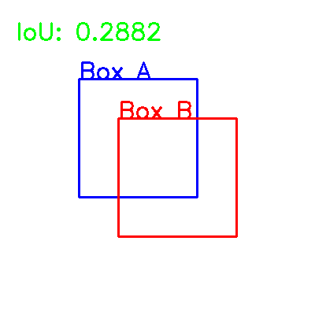

# Intersection-over-Union
A simple implementation of the Intersection over Union (IoU) in NumPy, TensorFlow and PyTorch.

# Article
For more explanation, please check my article on [idiotdeveloper.com](idiotdeveloper.com).  
[What is Intersection over Union (IoU)?](https://idiotdeveloper.com/what-is-intersection-over-union-iou)

# Example
This is the output from the `tf-numpy.py`. It is showing the iou score between two bounding boxes.

